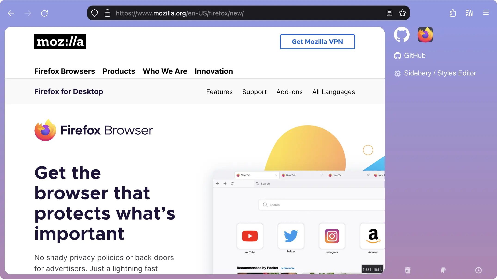

# Arc Firefox

## Setup Firefox

1. In Firefox go to `about:support`
1. Find **Profile Folder** and click **Show in Finder**
1. Open the selected unique strange folder, e.g. mine is `e24bt0p2.default-release`
1. Copy the `chrome` folder in this repo to it
1. In Firefox go to `about:config` find `toolkit.legacyUserProfileCustomizations.stylesheets` and set the value to `true`
1. Restart Firefox

## Setup Sidebery

1. Install Sidebery
1. In Sidebery settings: General > Preface Value, enable and set to default `[Sidebery] `
1. Cope the content of `sidebery.css` into `Styles editor`

## Development

In Firefox open Inspector(`Opt + Cmd + I`), go to **Settings** -> **Advanced settings**, enable below options and close Inspector.

- Enable browser chrome and add-on debugging toolboxes
- Enable remote debugging

Open the debugging toolbox by `Shift + Opt + Cmd + I`.

